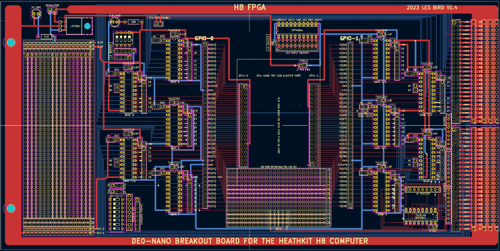
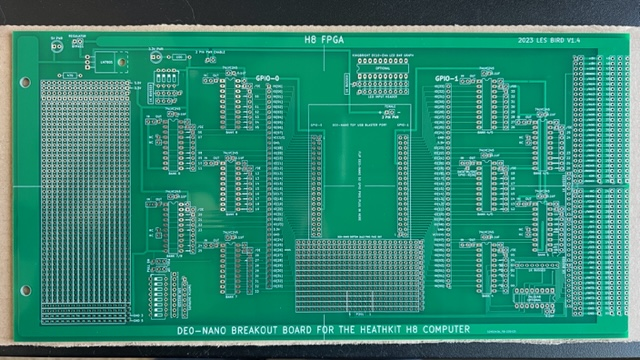
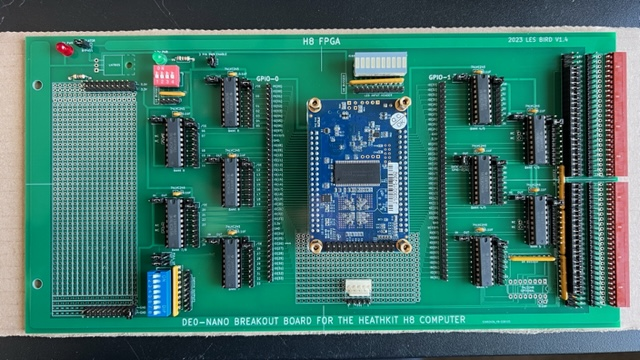
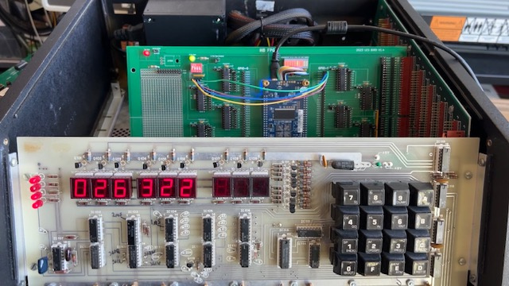
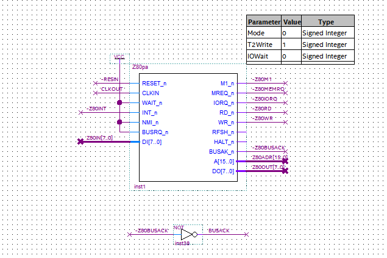
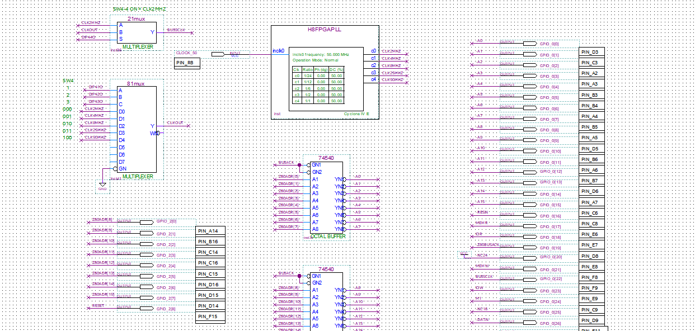
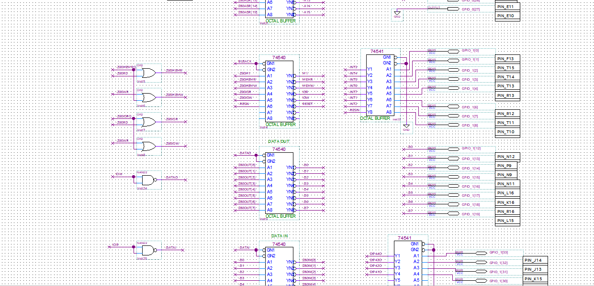
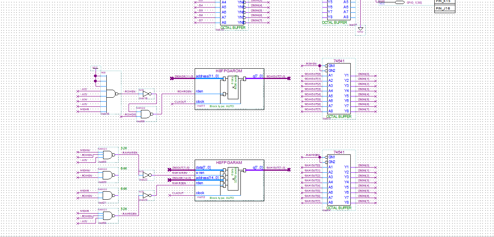
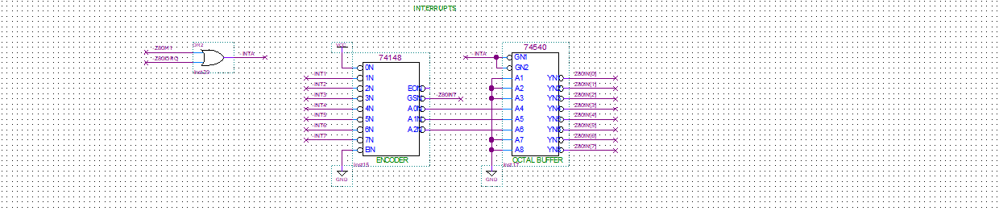
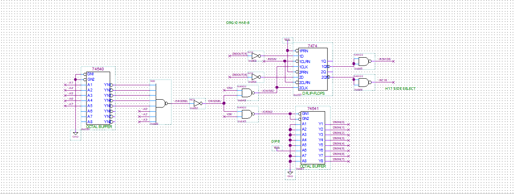

# H8FPGA
H8 Z80 CPU BOARD ON A DE0-NANO FPGA 
 
**THE PROJECT:** H8FPGA 
 
**GOALS** 
Put the H8 CPU card on a FPGA by designing a PCB to interface to the H8 BUSS and creating a FPGA BDF schematic to mimic a real H8 Z80 CPU card 
 
**PCB DESIGN** 
The PCB interfaces to the H8 BUSS by using 74LVC245 level converters. The converters handle converting the FPGA GPIO signals to the H8 BUSS (3.3V to 5V) and from the BUSS (5V to 3.3V). The PCB is made up of 10 level converters to translate all 66 GPIO pins of the DE0-NANO. Each level converter chip can be configured via a jumper to output to the BUSS or to input from the BUSS. By default all 5 converters on the left side of the PCB are set up to output to the BUSS (GPIO-0) and all 5 converters on the right side of the board are set up to input from the BUSS (GPIO-1). The board can also be configured via a bunch of jumpers to emulate a CPU board using a default set of routing of the level converter chips to the H8 BUSS. The pins are labeled with the appropriate H8 BUSS signals. One level converter chip has a special configuration as a bi-directional interface to the H8 BUSS to handle data bits to and from the BUSS. Its direction (in/out) is controlled by pin 26 of GPIO-0. A low on this line makes the direction of the chip input and a high makes the direction of the chip output. A jumper determines if the chip is configured as bi-directional and only if it is jumpered as such will GPIO-0 pin 26 control the direction. The PCB also has a jumper to configure the DE0-NANO to receive power from the H8 BUSS. In this case when the H8 is powered up the DE0-NANO will also power up. The PCB has 2 DIP switches (4-pin and 8-pin) and a LED bar graph for debugging. The 4 position switch is wired to pins 20, 21, 22 and 23 of the input pins (GPIO-1) and the 8 position switch is wired to pins 26 thru 33 on the input side. By default the purpose of the dip switches are as follows: 
**DIP4** = speed control (2MHZ to 50MHZ) and also pin 4 controls whether to send 2MHZ to the H8 BUSS or to send the selected speed to the H8 BUSS. 
**DIP8** = HA8-8 ORG-0 configuration - status byte of the HA8-8 ORG-0 configuration board. 
 
## PCB LAYOUT V1.4 
 

## PCB UNBUILT
 

## PCB BUILT
 

## PCB INSTALLED
 

## FPGA PROGRAMMING ##
The entire CPU card design was made using a BDF schematic file (see below). This is the process of laying out the FPGA design as if you were making a schematic of a PCB. The schematic includes on-chip ROM and RAM to support the H8 computer design. The ROM files are loaded as INTEL HEX files. For the Z80 CPU emulation I chose to use the T80 Z80 core that I grabbed from this repo [mist-devel](https://github.com/mist-devel/T80). I originally tried using the **T80s** core, which is well known and popular, but I had a lot of difficulty getting that to work without some ugly hacks. After doing some research and looking at the cores used in the MiSTer project such as for the TRS-80 I decided to switch to the **T80pa** core. This core worked perfectly and is the core I decided to move forward with in the H8FPGA project. 

## QUARTUS BDF SCHEMATICS
 
 
 
 
 
 

## STATE OF THE PROJECT
As of the initial commit (Feb 10, 2023) I have a fairly stable emulation of a basic Z80 CPU card for the H8 computer. You can interact with the front panel controls and even enter programs using the front panel keypad. The configuration of the system on the FPGA is as follows: 
**Z80 CPU running at 2.08MHz** 
**XCON8 4K ROM** 
**32K on-chip RAM** (DE0-NANO does not have enough on-chip memory to handle a 4K ROM and 64K of RAM) 
**HA8-8 ORG-0 configuration card** 
 
All RAM reads/writes are handled directly on the FPGA on-chip RAM and not sent to the H8 BUSS 
All I/O reads/writes are sent to the H8 BUSS with the exception of the ORG-0 port address which is handled internally on the FPGA 
Interrupts from the H8 BUSS are handled properly 

## TO-DO ##
Get it working with the H8-4 serial I/O card for communicating with a RS-232 terminal such as the Heathkit H19 
Get it working with the H17 hard sector disk controller card for booting to HDOS and CP/M 
Get it working with the DE0-NANO 32MB SDRAM instead of on-chip RAM so can have a 4K ROM and 64K of RAM 
