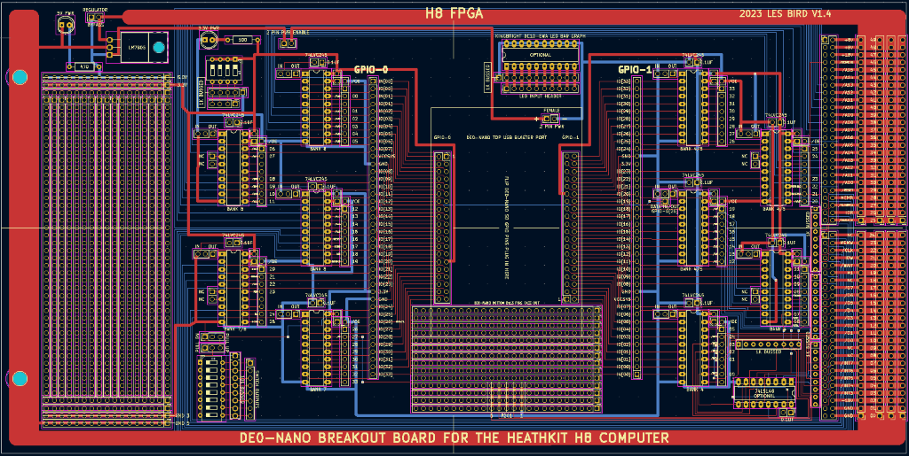
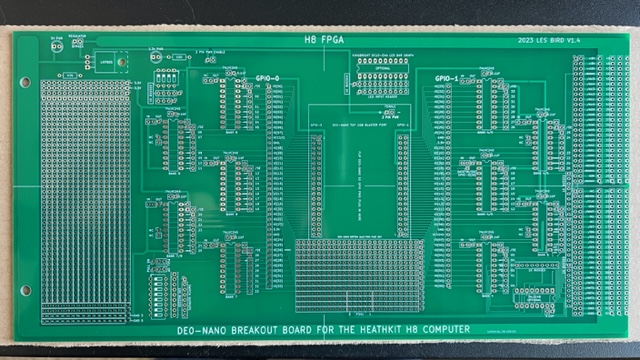
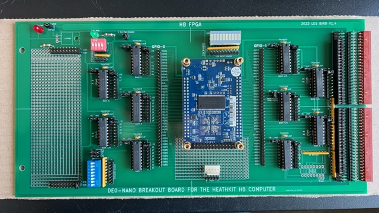
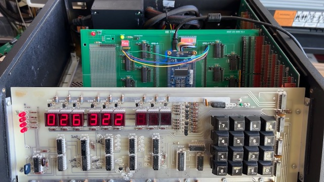
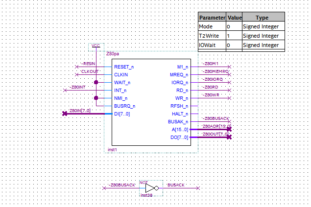
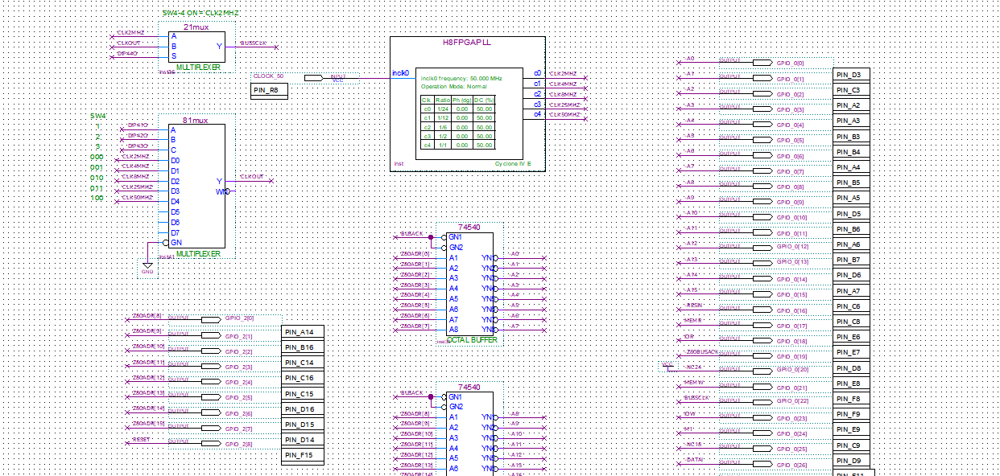
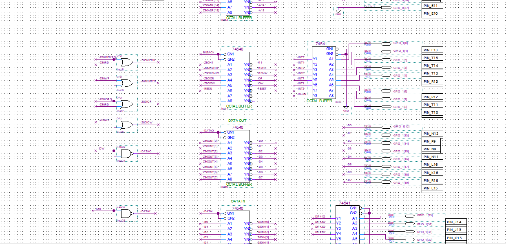
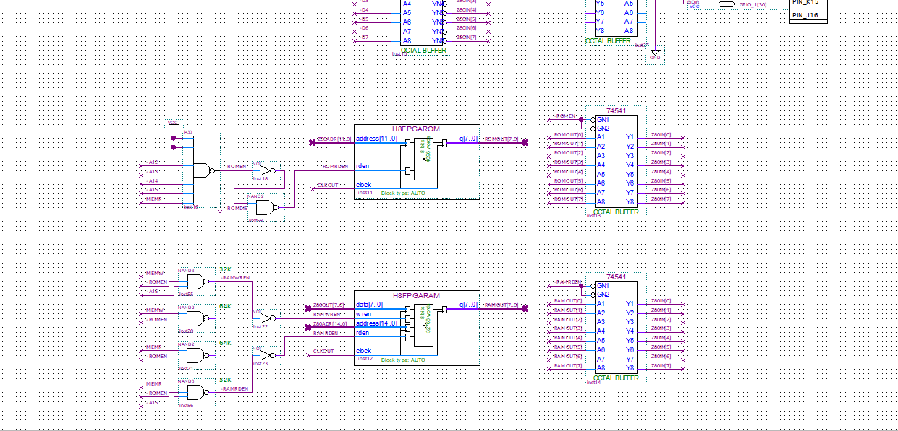
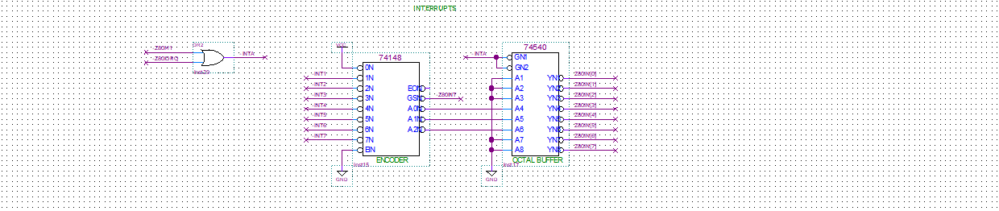
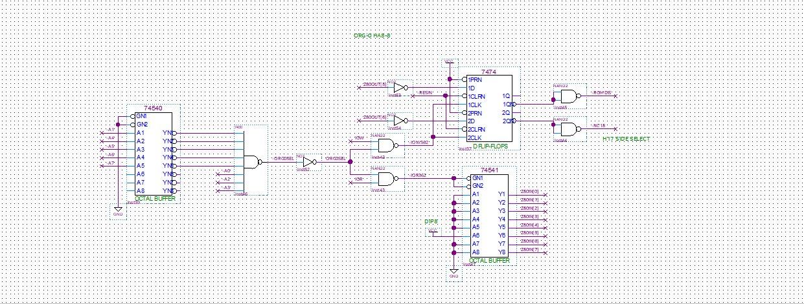

# H8FPGA
H8 Z80 CPU BOARD ON A DE0-NANO FPGA<br>
<br>
**THE PROJECT:** H8FPGA<br>
<br>
**GOALS**<br>
Put the H8 CPU card on a FPGA by designing a PCB to interface to the H8 BUSS and creating a FPGA design to mimic a real H8 Z80 CPU card<br>
<br>
**PCB DESIGN**<br>
The PCB interfaces to the H8 BUSS by using 74LVC245 level converters. The converters handle converting the FPGA GPIO signals to the H8 BUSS (3.3V to 5V) and from the BUSS (5V to 3.3V). The PCB is made up of 10 level converters to translate all 66 GPIO pins of the DE0-NANO. Each level converter chip can be configured via a jumper to output to the BUSS or to input from the BUSS. By default all 5 converters on the left side of the PCB are set up to output to the BUSS (GPIO-0) and all 5 converters on the right side of the board are set up to input from the BUSS (GPIO-1). The board can also be configured via a bunch of jumpers to emulate a CPU board using a default set of routing of the level converter chips to the H8 BUSS. The pins are labeled with the appropriate H8 BUSS signals. One level converter chip has a special configuration as a bi-directional interface to the H8 BUSS to handle data bits to and from the BUSS. Its direction (in/out) is controlled by pin 26 of GPIO-0. A low on this line makes the direction of the chip input and a high makes the direction of the chip output. A jumper determines if the chip is configured as bi-directional and only if it is jumpered as such will GPIO-0 pin 26 control the direction. The PCB also has a jumper to configure the DE0-NANO to receive power from the H8 BUSS. In this case when the H8 is powered up the DE0-NANO will also power up. The PCB has 2 DIP switches (4-pin and 8-pin) and a LED bar graph for debugging. The 4 position switch is wired to pins 20, 21, 22 and 23 of the input pins (GPIO-1) and the 8 position switch is wired to pins 26 thru 33 on the input side. By default the purpose of the dip switches are as follows:<br>
**DIP4** = speed control (2MHZ to 50MHZ) and also pin 4 controls whether to send 2MHZ to the H8 BUSS or to send the selected speed to the H8 BUSS.<br>
**DIP8** = HA8-8 ORG-0 configuration - status byte of the HA8-8 ORG-0 configuration board.<br>
<br>

## PCB LAYOUT V1.4<br>
<br>

## PCB UNBUILT
<br>

## PCB BUILT
<br>

## PCB INSTALLED
<br>

## FPGA PROGRAMMING ##
The CPU card was originally designed entirely as a BDF schematic file (see below). This is the process of laying out the FPGA design as if you were making a schematic of a PCB. The schematic includes on-chip ROM and RAM to support the H8 computer design. The ROM files are loaded as INTEL HEX files. For the Z80 CPU emulation I chose to use the T80 Z80 core that I grabbed from this repo [mist-devel](https://github.com/mist-devel/T80). I originally tried using the **T80s** core, which is well known and popular, but I had a lot of difficulty getting that to work without some ugly hacks. After doing some research and looking at the cores used in the MiSTer project such as for the TRS-80 I decided to switch to the **T80pa** core. This core worked perfectly and is the core I decided to move forward with in the H8FPGA project.<br>
<br>
The design has since been ported from the BDF schematic to Verilog to address a set of stability problems — see **[THE REWORK](#the-rework)** below. `H8FPGA.bdf` is kept in the repo as a reference for the original schematic but is no longer part of the build.<br>

## QUARTUS BDF SCHEMATICS
The original schematic, retained for reference:<br>
<br>
<br>
<br>
<br>
<br>
<br>

## STATE OF THE PROJECT

**The original BDF design** (initial commit Feb 10, 2023) is a fairly stable
emulation of a basic Z80 CPU card for the H8. You can interact with the front
panel controls and even enter programs using the front panel keypad. The
configuration on the FPGA is:<br>
**Z80 CPU running at 2.08MHz**<br>
**XCON8 4K ROM**<br>
**32K on-chip RAM**<br>
**HA8-8 ORG-0 configuration card**<br>
<br>
All RAM reads/writes are handled directly on the FPGA on-chip RAM and not sent to the H8 BUSS<br>
All I/O reads/writes are sent to the H8 BUSS with the exception of the ORG-0 port address which is handled internally on the FPGA<br>
Interrupts from the H8 BUSS are handled properly<br>
<br>
This is the version that has actually run in an H8.

**The Verilog rework** is what is on `main` now. It is verified in simulation but
**has not yet been compiled in Quartus or run on hardware.** If you want a
known-working bitstream, build from commit `4a71156` or earlier, which is the
last state of the original BDF design.

## THE REWORK

The BDF design was a TTL schematic transcribed literally into an FPGA, and most
of its instability traced back to that one mismatch: asynchronous ripple logic,
internal tri-state buses, and a CPU clock you could mux with a DIP switch are
all reliability hazards on a Cyclone IV even though they were fine on a 1978 PCB.

`STABILITY-REVIEW.md` documents every finding in detail, with the actual net and
instance names from the schematic. The headlines:

| Problem | What it caused |
|---|---|
| No `.sdc` file at all | Quartus analyzed no timing and optimized for nothing; every recompile produced a differently-timed machine |
| 82 assigned pins absent from the design | Quartus's default drives unused pins to ground — 23 GPIO were pulling the H8 backplane low through the '245s, and the EPCS config flash pins were driven as outputs |
| CPU clock was a combinational LUT mux off a raw DIP switch | Glitched on every contact bounce; mux inputs D5/D6/D7 were unconnected, so three DIP positions stopped the CPU dead |
| `Z80IN[7:0]` was a 5-driver internal tri-state bus | Cyclone IV has no internal tri-states; nothing enforced one-hot and nothing defined the idle value |
| Reset went straight into the core, unsynchronized | T80 is deeply pipelined; asynchronous release lets stages exit reset on different clocks — "boots fine most of the time" |
| Nothing crossing from the backplane was synchronized | Interrupts were priority-encoded *before* registration, so a line changing mid-cycle could corrupt the acknowledge |
| The '245 direction rested pointing *outward* | The board was amplifying floating FPGA pins onto the H8 data bus during every memory and idle cycle |
| ORG-0 ROM disable never worked | `-ROMDIS` only froze the ROM's output register while its buffer kept driving and RAM stayed locked out — reads returned stale ROM. **This is what blocks HDOS and CP/M.** |
| `GPIO_1[20]` shorted to an internal GND | FPGA driving against the '245 that drives into it, and DIP4-1 was stuck |

The rework runs everything in one 50 MHz clock domain and drives the Z80 with
T80pa's `CEN_p`/`CEN_n` clock enables — which is what that core was designed for
and why it was chosen in the first place. Speed selection becomes a divisor
change, so the clock can no longer glitch. Available rates are 2.083 / 4.17 /
8.33 / 25 MHz; 50 MHz is not reachable with a two-phase clock-enable scheme,
whose ceiling is half the master clock.

RAM now lives in the DE0-Nano's 32MB SDRAM, so a 4K ROM and a full **64K of
RAM** fit at last. The 66 M9K blocks on an EP4CE22 cannot hold both (68 would be
needed), which is what limited the original to 32K. The ROM deliberately stays
in M9K — SDRAM is volatile and the CPU fetches from `0x0000` the instant it
leaves reset. `USE_SDRAM=0` selects the original 32K on-chip RAM as a bring-up
fallback.

### Source layout

```
RTL/h8fpga_top.v   top level, replaces H8FPGA.bdf
RTL/h8_clkgen.v    CEN_p/CEN_n generator, replaces the clock muxes
RTL/h8_reset.v     reset synchronizer / stretcher / debouncer
RTL/h8_sync.v      input synchronizers and DIP debounce
RTL/h8_intctl.v    interrupt priority encoder and RST vector
RTL/h8_org0.v      ORG-0 board, port 0362
RTL/h8_busif.v     '245 turnaround sequencing
RTL/h8_memmap.v    address decode and read priority mux
RTL/h8_sdram.v     SDRAM controller
H8FPGA.sdc         timing constraints
SIM/               testbenches and simulation models
```

## SIMULATION

Requires [Icarus Verilog](https://github.com/steveicarus/iverilog). A prebuilt
[oss-cad-suite](https://github.com/YosysHQ/oss-cad-suite-build) works too.

```
cd SIM
make all        # unit tests, SDRAM controller, top level (both RAM backends)
make mutate     # confirm the tests actually catch regressions
```

Or point at a specific install with `make IVDIR=/path/to/bin all`.

Current status: 57 unit checks, 17 SDRAM checks with zero protocol violations,
and 16 top-level checks against a scripted CPU stub — run twice, once per RAM
backend, which must produce identical read traces.

`make mutate` exists because a test suite that passes first try deserves
suspicion. Each mutation reintroduces one of the original defects and must be
reported as a failure.

**What simulation does not cover:** the real T80pa is VHDL and invisible to
Icarus, so `SIM/stubs.v` swaps in a scripted bus-cycle generator. That proves
wiring, bus polarity, memory-map routing, ORG-0 behaviour and turnaround
sequencing — not Z80 correctness. The SDRAM model also treats read data as valid
for a clean clock period, so the electrical capture point still needs confirming
against the datasheet and TimeQuest.

## TO-DO ##
Compile the rework in Quartus and confirm T80 closes timing at 50MHz — if it does not, drive the design from a 25MHz PLL output and halve the divisors in `h8_clkgen`<br>
Bring the rework up on real hardware<br>
Wire `WAIT_n` to the H8 BUSS wait/hold line — T80pa's WAIT_n does work, but which backplane pin carries it still needs to be identified from the PCB schematic. Without wait states no card can hold off the CPU, which is what blocks the two items below<br>
Get it working with the H8-4 serial I/O card for communicating with a RS-232 terminal such as the Heathkit H19<br>
Get it working with the H17 hard sector disk controller card for booting to HDOS and CP/M<br>
Route the bidirectional '245's /OE to a spare GPIO_0 pin on a V1.6 PCB, so the data bus turnaround can have a true high-impedance guard band<br>
<br>
**DONE:** Get it working with the DE0-NANO 32MB SDRAM instead of on-chip RAM so can have a 4K ROM and 64K of RAM — implemented and simulated, pending hardware validation<br>
